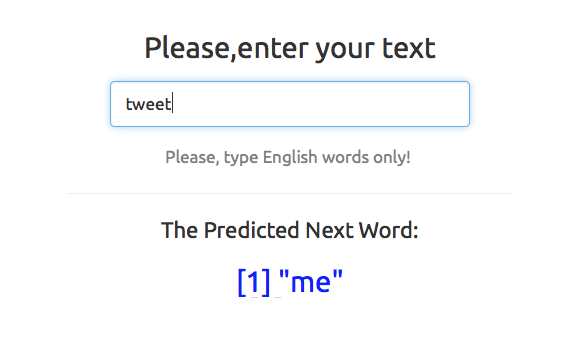

# RCapProject

### Coursera Data Science Capstone Project
This is the application made for final project on Coursera Data Science specialization. Special thanks goes to professors of the Johns Hopkins University, SwiftKey for providing data, Coursera for providing learning platforms and R-sudio&Shiny apps for providing app-deployment platform.

******

#### The Main Objective

The main objective of this project is to build nex-word predictor shiny app. There are several steps viz: data cleansing, exploratory analysis, preparing n-grams, predictive model and display results. Provided text data was used to create a frequency dictionary which was later used to predict the next words that comes from a corpus of data. There are veriety of R-packages available for cleaning, processing, modeling and disply activity. Few of them are listed in references.

******

#### Methodology

For creating a data sample from the corpus of data and making model from it has following steps:

  - Provided data was cleaned by conversion to lowercase, removing punctuation, links, white space, numbers and all kinds of special characters etc.
  
  - This data sample was then tokenized.
  
  - Those aggregated bi-,tri- and quadgram term frequency matrices was transferred into frequency dictionaries.

  - The resulting data-frames are used to predict the next word in connection with the text input by a user of the described application and the frequencies of the underlying *n*-grams table.

******

#### How to use The Application

 User can enter the text into the text input box(field), the predicted next word instantaneously show up in the lower box(field) as shown in figure below.

******

#### References

* what is 'n-gram model': [https://en.wikipedia.org/wiki/N-gram](https://en.wikipedia.org/wiki/N-gram)
* Text-mining: [http://www.r-bloggers.com/intro-to-text-analysis-with-r/](http://www.r-bloggers.com/intro-to-text-analysis-with-r/)
* Introduction to text mining:[https://eight2late.wordpress.com/2015/05/27/a-gentle-introduction-to-text-mining-using-r/](https://eight2late.wordpress.com/2015/05/27/a-gentle-introduction-to-text-mining-using-r/)
*  Coursera Data Science Specialization: [https://www.coursera.org/specialization/jhudatascience/1](https://www.coursera.org/specialization/jhudatascience/1)
* 'tm' package for text mining: [https://www.cran.r-project.org/web/packages/tm/vignettes/tm.pdf](https://www.cran.r-project.org/web/packages/tm/vignettes/tm.pdf)
* Coursera: Analyze Text, Discover Patterns, Visualize Data:[https://www.coursera.org/specializations/data-mining](https://www.coursera.org/specializations/data-mining)

